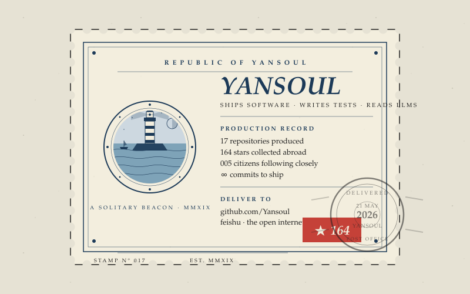

 

> *Postmarked from somewhere between Java test runners and LLM tooling.*
> *Mostly the latter, lately.*

### · Return address

I'm **Yansoul**. I build small useful things — LLM-flavored test tooling, an automation framework or two, the occasional Vue / Next interface. Been shipping code since MMXIX.

### · Recent dispatches

| repository | what's inside |
|------------|---------------|
| **[gen-test-case](https://github.com/Yansoul/gen-test-case)** | LLM-generated API test cases |
| **[token-arc](https://github.com/Yansoul/token-arc)** | Distribute software features by multimodal user behaviour |
| **[autoTest](https://github.com/Yansoul/autoTest)** | Java-based interface automation |
| **[studynext](https://github.com/Yansoul/studynext)** | Next.js sandbox |

### · Mail to this address

- **github** — issues, PRs, the occasional star
- **feishu / lark** — `@yansoul` *(internal channels)*
- **the open internet** — routes vary

---

<i>Stamp Nº 017 · Edition 1/1 · cancelled 21 May 2026</i>
